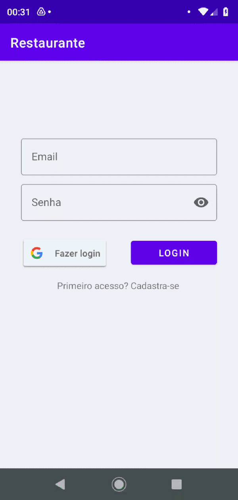
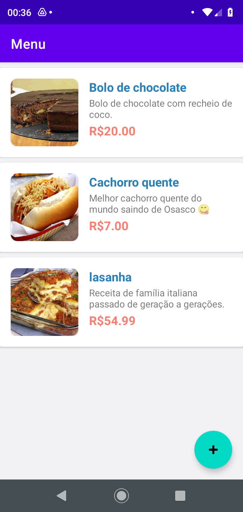

# Restaurante

Aplicativo de um restaurante onde é obrigatório realizar um login para poder entrar na tela de menu, nessa tela o cliente vai encontrar todos os pratos registrado no Firebase, e podendo registrar mais pratos com suas fotos no Realtime do Firebase, foi utilizado a arquitetura MVP para desenvolver esse aplicativo.

## Tecnologias utilizadas:

- [x] Java
- [ ] MVP
- [x] Firebase: Authentication, Realtime e Storage

### Cadastro Usuário

### Login Usuário (Manualmente e Google)

  
  

### Menu

### Prato (Cadastrar e excluir Prato)

  
  

